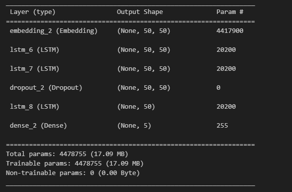

# Document Classification

Document classification, also known as text classification or document categorization, is a natural language processing (NLP) task that involves assigning predefined categories or labels to a given document based on its content. The goal is to automatically categorize or organize a large collection of unstructured text documents into meaningful and predefined categories. This task is essential for various applications, such as spam filtering, sentiment analysis, topic categorization, and more.

## Setting Up Conda Environment

Step 1: Create a conda environment

```
conda --version
```

Step2: Create a conda environment

```
conda create -p venv python==3.10 -y
```

Step3:

For windows command prompt

```
conda activate venv/
```

For linux

```
source activate venv/
```

Step4:

```
pip install -r requirements.txt
```

## How to run this project

If you want to track the evaluation results using mlflow and dagshub, you will need to setup the dagshub account and connect it to your github repository and set up environment variables.

You can set up env variables for the running session on gitbash using the following commands.

```
MLFLOW_TRACKING_URI= "YOUR URI"
MLFLOW_TRACKING_USERNAME= "YOUR USERNAME"
MLFLOW_TRACKING_PASSWORD= "YOUR TRACKING PASSWORD"
```

## Models Used

**ML Models**

This project utilized several machine learning models for classification, including:
Multinomial Naive Bayes (MNB): This is a simple yet effective model that assumes features are independent given the class label. It was trained on document-term matrices (DTMs) and achieved an accuracy of around 71%.

Decision Tree: A tree-based model that splits data based on feature values to make predictions. It was trained with the entropy criterion and a random state of 10, achieving an accuracy of around 73%.

Random Forest: This ensemble method combines multiple decision trees for improved performance. It was trained on DTMs and delivered an accuracy of around 75% .

XGBoost: A powerful gradient boosting framework known for its ability to handle complex data. It was trained on DTMs and achieved the highest accuracy of 83% among all ML models with its default parameters.

## DL Models

This project employed a Long Short-Term Memory (LSTM) based architecture for text classification.
Using LSTM we achieve highest accuracy of around 97%

**Model Summary for LSTM Model**

